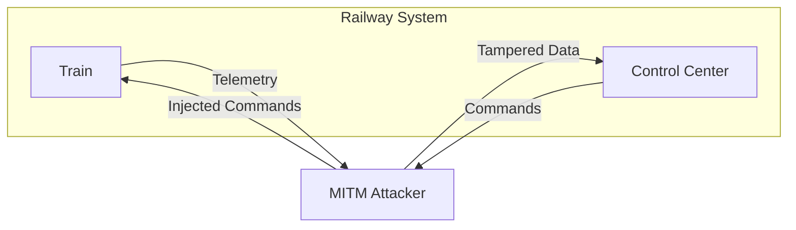

# MITM Railway Attack Simulator

An interactive cybersecurity simulation that demonstrates how **Man-in-the-Middle (MITM) attacks** can disrupt real-time railway control systems.


---

## Overview

MITM Railway Attack Simulator is a Streamlit-based simulation of a railway communication system, where a train exchanges data with a control center. The project demonstrates how an attacker positioned between these components can intercept, manipulate, and replay messages - leading to unsafe system behavior. This simulation highlights the importance of **secure communication in critical infrastructure systems**.

---

Live Demo: 
https://mitm-railway-attack-simulator.streamlit.app/ 

---
## Project Structure

```
mitm-railway-attack-simulator/
│
├── .github/
│   └── workflows/
│       └── codeql.yml
├── app.py
├── requirements.txt
├── README.md
├── SECURITY.md
├── LICENSE
├── .gitignore
```

---

## System Architecture

The system consists of three main components:

- **Train System**  
  Sends telemetry data (speed, status, signal)

- **Control Center**  
  Sends operational commands (STOP, GO, SLOW)

- **Attacker (MITM)**  
  Intercepts and manipulates communication between the two



## MITM Attack Variants

The simulator implements three types of Man-in-the-Middle attacks:

### Data Manipulation
- Alters telemetry data sent from the train  
- Example: speed changes from 60 → 200  
- Impact: control center makes incorrect decisions  


---

### Command Injection
- Modifies commands sent to the train  
- Example: STOP → GO  
- Impact: unsafe system behavior (unexpected acceleration)  


---

### Replay Attack
- Reuses previously sent commands  
- Example: repeats an old STOP command  
- Impact: delayed or inconsistent system response  


---

## Security Mode

The simulation includes a security layer that represents:

- Data validation  
- Integrity checks  
- Secure communication mechanisms  

When enabled:
- Manipulated data is detected  
- Attacks are blocked  
- System behavior stabilizes  


---

## Features

- Real-time system simulation  
- Interactive attack selection  
- Original vs Tampered data comparison  
- Dynamic risk level calculation  
- System logs (SOC-style monitoring)  
- Live charts (speed & risk over time)  
- Critical condition detection (e.g. overspeed)  

---

## System Behavior

The system reacts dynamically to commands and attacks:

- Speed increases/decreases based on commands  
- Overspeed (>180 km/h) triggers critical alerts  
- Conflicting signals generate warnings  
- Risk level increases with malicious activity

---

## Visualization

The dashboard provides:

- Speed & risk charts over time  
- Real-time risk level indicator  
- Event logs showing system activity and attacks  


---

## Purpose

This project is designed for:

- Educational use (cybersecurity concepts)  
- Demonstrating risks in cyber-physical systems  
- Understanding MITM attack mechanisms  
- Visualizing cause-and-effect in system security  

---

## How to Run

1. Install dependencies:

```bash
pip install -r requirements.txt
```

2. Run the application:

```bash
streamlit run app.py
```
---

## Key Takeaways
- MITM attacks can manipulate both data and control signals
- Even simple attacks can lead to critical system failures
- Security mechanisms are essential in real-time systems
- Cybersecurity is crucial for critical infrastructure like railways

---

## Future Improvements
- AI-based anomaly detection
- Advanced attack scenarios

---

## License

This project is licensed under the MIT License.
